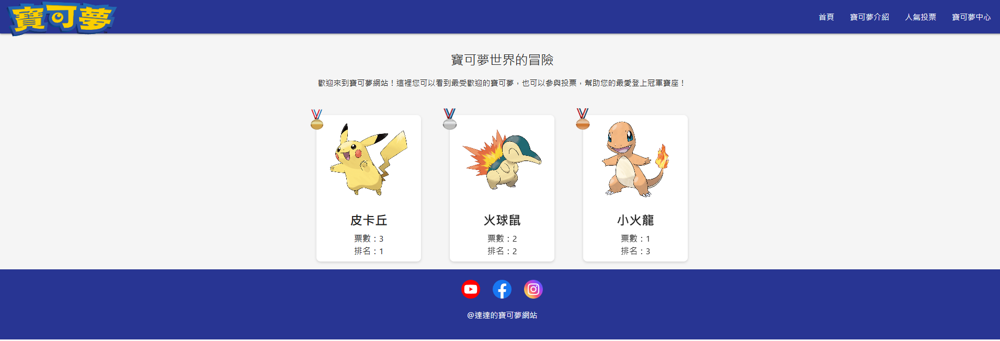

📌專題簡介

這是我在學校網頁設計課程中的期末專題作品，使用 HTML、CSS 和 JavaScript 打造一個以「寶可夢」為主題的靜態網站。

🛠 使用技術

HTML5

CSS3

JavaScript

Google試算表、表單(作為資料庫)

GitHub Pages (作為部署平台)

🔗 網站連結

[點我進入寶可夢世界](https://deco0926.github.io/mywebsite/)

📷 預覽畫面

